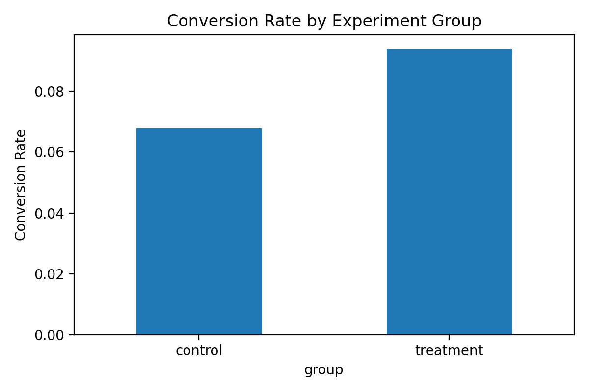

# A/B Testing for Marketing Campaigns (Python)

This project evaluates the effectiveness of a marketing campaign using a controlled A/B experiment. The objective is to determine whether a new campaign strategy leads to a statistically significant improvement in conversion rate and revenue.

## Business Problem
A marketing team wants to decide whether to roll out a new campaign strategy. The decision must be supported by data-driven evidence.

## Data
- Synthetic but realistic marketing experiment data
- 12,000 users randomly assigned to:
  - Control group (existing campaign)
  - Treatment group (new campaign)
- Key variables:
  - `user_id`
  - `group`
  - `converted`
  - `revenue`

> Synthetic data was generated to replicate real-world campaign behavior while ensuring full reproducibility.

## Methodology
- Generated experimental data in Python
- Aggregated performance metrics by group
- Calculated conversion rate and revenue per user
- Measured uplift between treatment and control
- Conducted hypothesis testing using a two-sample proportion z-test
- Estimated 95% confidence intervals for conversion rate differences
- Visualized results for decision-making

## Key Results
- Treatment campaign achieved a higher conversion rate than the control group
- The uplift was statistically significant (p-value < 0.001)
- Revenue per user increased for the treatment group
- Confidence intervals confirmed the robustness of the observed lift

## Visualization
**Conversion Rate by Experiment Group**



## Decision
Based on statistically significant uplift and positive revenue impact, the recommendation is to roll out the treatment campaign, with continued monitoring of long-term performance.

## Files in This Repository
| File | Description |
|------|------------|
| `ab_testing_marketing_experiment.ipynb` | Full experiment analysis and statistical testing |
| `marketing_ab_test_data.csv` | Generated experiment dataset |
| `conversion_rate_comparison.png` | Conversion rate comparison chart |
| `requirements.txt` | Python dependencies |

## How to Run
```bash
pip install -r requirements.txt

